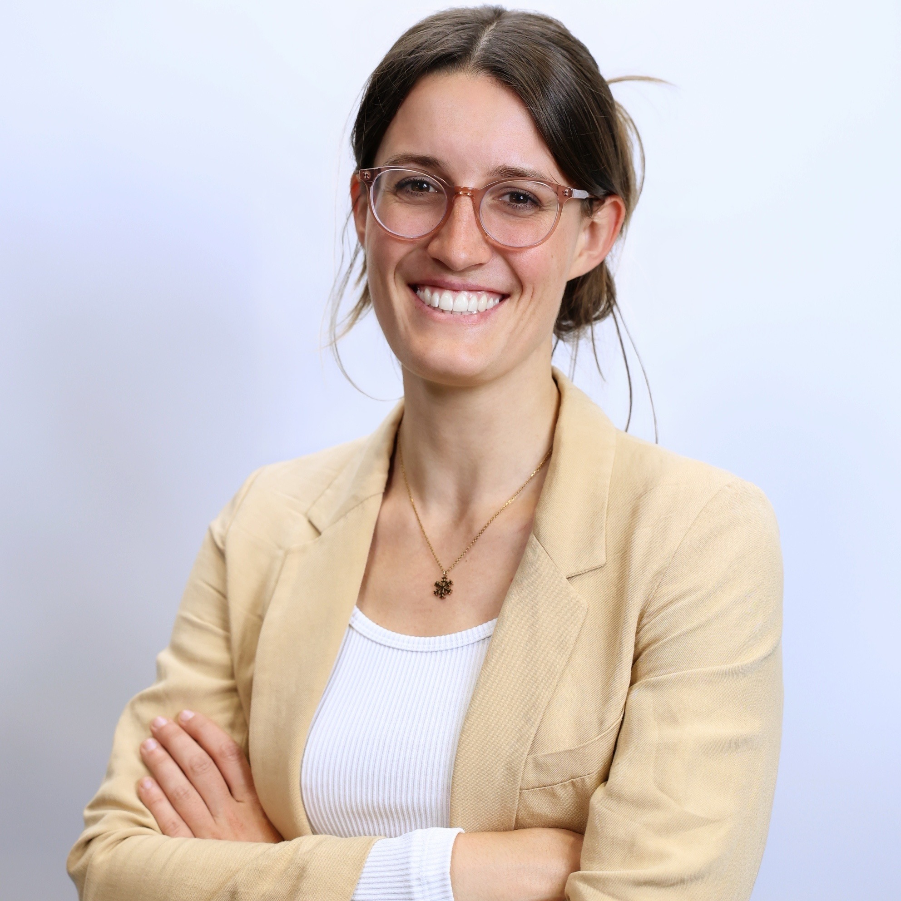

---
# Feel free to add content and custom Front Matter to this file.
# To modify the layout, see https://jekyllrb.com/docs/themes/#overriding-theme-defaults

layout: home
title: About me
---

 

  
I'm a third year PhD student in computer vision at the Dynamic Vision and Learning group and Technical University of Munich. I'm interested in perception in 2D and 3D, graph neural networks, and motion!
        After my Bachelor's degree in Mechanical Engineering at the Technical University of Munich, I obtained a Master's degree in Robotics, Cognition, and Intelligence also at the Technical University of Munich. During my studies, I did several internships and had several working student jobs, among others in the fields of Deep Learning-based lane detection and Graph Neural Networks. In my Master's, I specialized in Deep Learning and Machine Learning and wrote my thesis on Deep Metric Learning at the Dynamic Vision and Learning group under the supervision of Dr. Ismail Elezi and Prof. Dr. Laura Leal-Taixé. Following my thesis, I started a PhD position at the beginning of 2021 also at the Dynamic Vision and Learning group. In 2023, I spent 10 months at NVIDIA as a research intern working on 3D detection. Apart from my work, I do lots of sports preferably in somewhere out and about in the mountains, but also love to just sit down with a good book!

  

 
   

 |  |   | 

   

## Updates

- 2034/12/15: I will join the group of Prof. Ramanan at CMU for a vising PhD from Feburary!
- 2023/12/05: After submitting the results fo my internship to CVPR I'm back at the University!
- 2023/02/06: I joined NVIDIA for a 10 months intership working on LiDAR point clouds!

