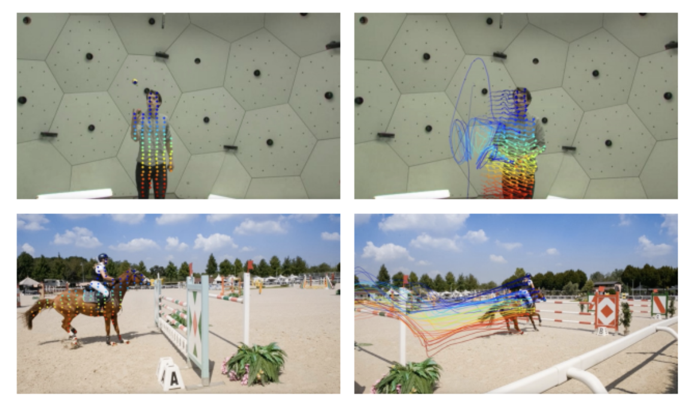
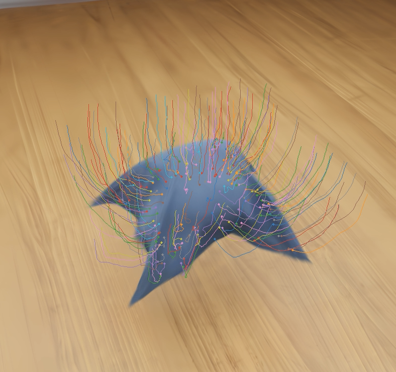

---
# Feel free to add content and custom Front Matter to this file.
# To modify the layout, see https://jekyllrb.com/docs/themes/#overriding-theme-defaults

layout: page
title: Publications
---

  

Jenny Seidenschwarz, Qunjie Zhou, Bardenius Duisterhof, Deva Ramanan, Laura Leal-Taixé. “DynOMo: Online Point Tracking by Dynamic Online Monocular Gaussian Reconstruction” (arxiv 2023)

We explore dynamic, online, monocular 3D reconstruction with Gaussian Splatting to perform online point tracking. Exploiting depth information as well as strong semantic image features together with physics-based priors that we also enhace with semantircs, DynOMo generates emerging trajectories and extends the world over the video.  <a href="https://arxiv.org/abs/2409.02104">[paper]</a> 
 

   

  

Bardienus P. Duisterhof, Zhao Mandi, Yunchao Yao, Jia-Wei Liu, Jenny Seidenschwarz Mike Zheng Shou, Deva Ramanan, Shuran Song, Stan Birchfield, Bowen Wen, Jeffrey Ichnowski. “DeformGS: Scene Flow in Highly Deformable Scenes for Deformable Object Manipulation” (WAFR 2024)

 We epxplote accurate dense 3D tracking of deformable objects for robotic manipulation with 3D Gaussians in a multi-camera setup to be able to teach robots how to fold, drape, or reposition deformable objects. DeformGS builds on a neural deformation function as well as physics inspired regiularization terms. <a href="https://deformgs.github.io/paper.pdf">[paper]</a> / <a href="https://github.com/momentum-robotics-lab/deformgs">[code]</a> / <a href="https://deformgs.github.io">[project page]</a> 
 
 

   

  

Jenny Seidenschwarz, Aljoša Ošep, Francesco Ferroni, Simon Lucey, Laura Leal-Taixé. “SeMoLi: What Moves Together Belongs Together.” (CVPR 2024)

We re-think motion-inspired heuristic-based approaches to generate pseudo-labels for LiDAR-based object detection. Both, object detection as well as motion-inspired pseudo-labeling, can be tackled in a data-driven manner. We leverage recent advances in scene flow estimation to obtain point trajectories from which we extract long-term, class-agnostic motion patterns.  <a href="https://arxiv.org/abs/2402.19463">[paper]</a> / <a href="https://github.com/dvl-tum/SeMoLi">[code]</a> / <a href="https://research.nvidia.com/labs/dvl/projects/semoli">[project page]</a> 
 
 

   

 

  

Jenny Seidenschwarz, Guillem Brasó, Ismail Elezi, Laura Leal-Taixé. “Simple Cues Lead to a Strong Multi-Object Tracker.” (CVPR 2023)

We ask ourselves whether simple good old Tracking-by-Detections methods are also capable of achieving the performance of end-to-end models. To this end, we propose two key ingredients that allow a standard re-identification network to excel at appearance-based tracking and extensively analyse its failure cases. <a href="https://arxiv.org/abs/2206.04656">[paper]</a> / <a href="https://github.com/dvl-tum/GHOST">[code]</a>
 

   

 

  

Ismail Elezi*, Jenny Seidenschwarz*, Laurin Wagner*, Sebastiano Vascon, Alessandro Torcinovich, Marcello Pelillo, Laura Leal-Taixé “The Group Loss++: A Deeper Look into Group Loss for Deep Metric Learning." (PAMI 2022)

We utilize the Group Loss, a loss function based on a differentiable label-propagation and design a set of inference strategies tailored towards our algorithm, named Group Loss++ that further improve the results of our model. With this we present a unified model for clustering and image retrieval, and person re-identification. <a href="https://arxiv.org/abs/2204.01509">[paper]</a>
 

   

 

  

Jenny Seidenschwarz, Ismail Elezi, Laura Leal-Taixé “Leanring Intra-Batch Connections for Deep Metric Learning." (ICML 2021)

We propose an approach based on message passing networks that takes all the relations in a mini-batch into account to refine embedding vectors among all samples in a given batch. Since not all samples are equally important to predict a decision boundary, we use an attention mechanism during message passing. <a href="https://arxiv.org/abs/2102.07753">[paper]</a> / <a href="https://github.com/dvl-tum/intra_batch">[code]</a>
 

 

