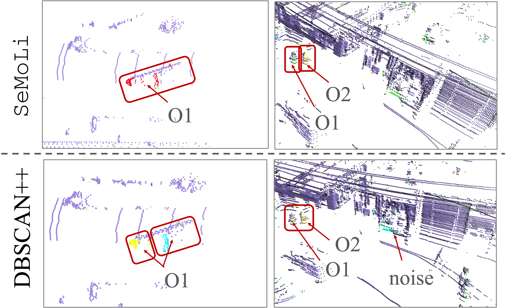
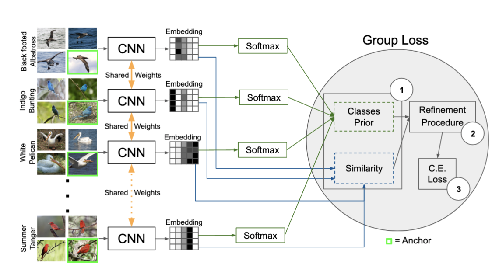
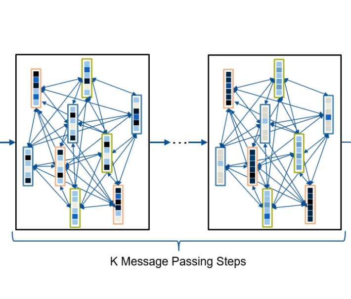

---
# Feel free to add content and custom Front Matter to this file.
# To modify the layout, see https://jekyllrb.com/docs/themes/#overriding-theme-defaults

layout: page
title: Publications
---

  

J. Seidenschwarz et al. “SeMoLi: What Moves Together Belongs Together.” (CVPR 2024 )

We re-think motion-inspired heuristic-based approaches to generate pseudo-labels for LiDAR-based object detection. Both, object detection as well as motion-inspired pseudo-labeling, can be tackled in a data-driven manner. We leverage recent advances in scene flow estimation to obtain point trajectories from which we extract long-term, class-agnostic motion patterns.  <a href="https://arxiv.org/abs/2402.19463">[paper]</a>
 

   

 

  

J. Seidenschwarz et al. “Simple Cues Lead to a Strong Multi-Object Tracker.” (CVPR 2023)

We ask ourselves whether simple good old Tracking-by-Detections methods are also capable of achieving the performance of end-to-end models. To this end, we propose two key ingredients that allow a standard re-identification network to excel at appearance-based tracking and extensively analyse its failure cases. <a href="https://arxiv.org/abs/2206.04656">[paper]</a> / <a href="https://github.com/dvl-tum/GHOST">[code]</a>
 

   

 

  

I. Elezi et al. “The Group Loss++: A Deeper Look into Group Loss for Deep Metric Learning." (PAMI 2022)

We utilize the Group Loss, a loss function based on a differentiable label-propagation and design a set of inference strategies tailored towards our algorithm, named Group Loss++ that further improve the results of our model. With this we present a unified model for clustering and image retrieval, and person re-identification. <a href="https://arxiv.org/abs/2204.01509">[paper]</a>
 

   

 

  

J. Seidenschwarz et al. “Leanring Intra-Batch Connections for Deep Metric Learning." (ICML 2021)

We propose an approach based on message passing networks that takes all the relations in a mini-batch into account to refine embedding vectors among all samples in a given batch. Since not all samples are equally important to predict a decision boundary, we use an attention mechanism during message passing. <a href="https://arxiv.org/abs/2102.07753">[paper]</a> / <a href="https://github.com/dvl-tum/intra_batch">[code]</a>
 

 

