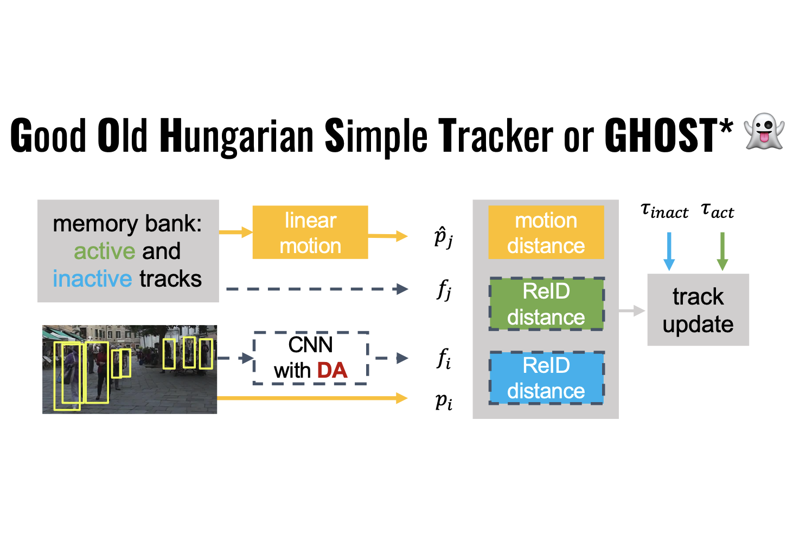

---
# Feel free to add content and custom Front Matter to this file.
# To modify the layout, see https://jekyllrb.com/docs/themes/#overriding-theme-defaults

layout: page
title: Publications
---

 

  
J. Seidenschwarz et al. “Simple Cues Lead to a Strong Multi-Object Tracker.” (CVPR 2023)
  In this paper, we ask ourselves whether simple good old Tracking-by-Detections methods are also capable of achieving the performance of end-to-end models. To this end, we propose two key ingredients that allow a standard re-identification network to excel at appearance-based tracking. We extensively analyse its failure cases, and show that a combination of our appearance features with a simple motion model leads to strong tracking results on MOT17, MOT20, BDD100k, and DanceTrack. <a href="https://arxiv.org/abs/2206.04656">[paper]</a> / <a href="https://github.com/dvl-tum/GHOST">[code]</a>
 

   

 

  
I. Elezi et al. “The Group Loss++: A Deeper Look into Group Loss for Deep Metric Learning." (PAMI 2022) 
We utilize the Group Loss for Deep Metric Learning, a loss function based on a differentiable label-propagation method that enforces embedding similarity across all samples of a group while promoting, at the same time, low-density regions amongst data points belonging to different groups. We design a set of inference strategies tailored towards our algorithm, named Group Loss++ that further improve the results of our model. We show state-of-the-art results on clustering and image retrieval, and present competitive results on two person re-identification datasets. <a href="https://arxiv.org/abs/2204.01509">[paper]</a>
 

   

 

  
J. Seidenschwarz et al. “Leanring Intra-Batch Connections for Deep Metric Learning." (ICML 2021) 
We propose an approach based on message passing networks that takes all the relations in a mini-batch into account. We refine embedding vectors by exchanging messages among all samples in a given batch allowing the training process to be aware of its overall structure. Since not all samples are equally important to predict a decision boundary, we use an attention mechanism during message passing to allow samples to weigh the importance of each neighbor accordingly. We show strong results on the CUB-200-2011, Cars196, Stanford Online Products, and In-Shop Clothes datasets. <a href="https://arxiv.org/abs/2102.07753">[paper]</a> / <a href="https://github.com/dvl-tum/intra_batch">[code]</a>
 

