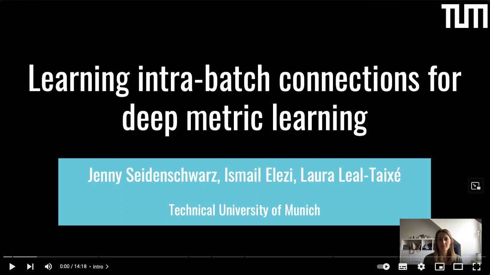

---
# Feel free to add content and custom Front Matter to this file.
# To modify the layout, see https://jekyllrb.com/docs/themes/#overriding-theme-defaults

layout: page
title: Talks
---

 

  
Simple Cues Lead to a Strong Multi-Object Tracker (CVPR Workshop 2023)
   I talked about our CVPR 2023 paper <a href="https://arxiv.org/pdf/2206.04656.pdf">"GHOST: Simple Cues Lead to a Strong Multi-Object Tracker"</a> in the "Tracking and Its Many Guises" Workshop at CVPR 2023. It was super fun to get roasted by questions and listen to all the other amazing talks. Find the list of speakers and talks <a href="http://taodataset.org/workshop/cvpr23/">here</a> and a similar presentation to the one I gave in the workshop on the right.

  
 

   

 

  
Tutorial on Deep Visual Similarity and Metric Learning (CVPR 2022)
   Together with Timo Milbich and Björn Ommer from Ludwigs Maximilians University Munich, we gave an introduction on learning visual similarity, the different objective functions that can be used, best practices as well as its wide variety of usages! Find the recording of the talks below and the slides <a href="https://dvsml2022-tutorial.github.io/index.html">here</a>. 

  
 

   

 

  
"Learning Inta-Batch Connections for Deep Metric Learning" (ICML 2021)
   I presented my first ever top-tier conference <a href="https://arxiv.org/abs/2102.07753">paper</a> at ICML 2021! Since it was still an online conference, we at least now have the recording of my presentation!

 

 
 

   

